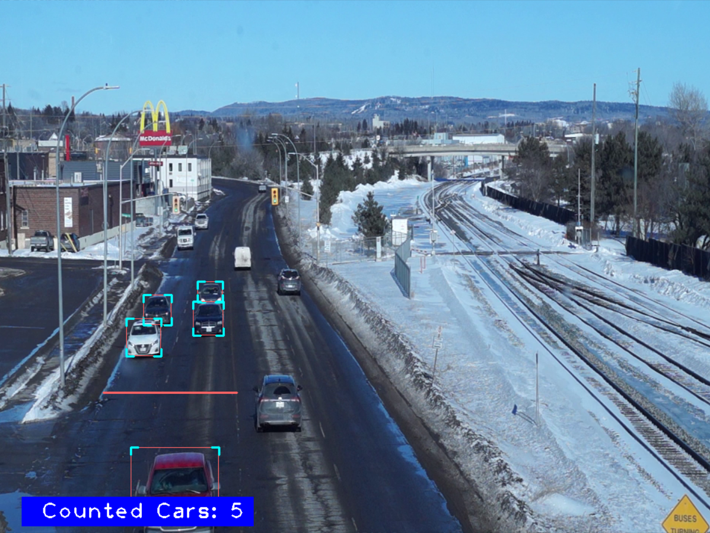

  <h1>Object Detection using Python</h1> 

## About this Project

This is an Object Detection Project using YOLOv8 as the models. The main idea of this project is to count the cars that cross the red line.
so that we can know the number of cars easily.

**notes:** `if you find that some cars from the model detects a car as 2, don't worry because this should be adaptable to the needs of your project, you can even use your own training model.`

#### This is an Example of Running Test from this Project

## Setup

If you want to see and test this project in more detail:

- Clone this repository `git clone https://github.com/nurhikam/Object-Detection-Python.git`
- Install dependencies with command `pip install -r requirements.txt`. If you using Pycharm just open the file `requirement.txt` and run it.
- Then, open the file of project you want to see and run it.

Please noted that the project will be running with your CPU,
If you want to boost the perform when running this project using your GPU, you can follow the steps below:

- Make sure you have installed `Desktop Development with C++`. If you haven't, download [Visual Studio Installer](https://visualstudio.microsoft.com/downloads/) and install install the `Desktop Development with C++`.
- Install GPU Drivers. For example I used `NVIDIA GPU`, you can download it from the following link [NVIDIA Drivers](https://www.nvidia.com/Download/index.aspx?lang=en-us) and adjust it according to your GPU type.
- Download [CUDA Toolkit](https://developer.nvidia.com/cuda-downloads) and adjust it according to your Operating System type. Because I'm using Windows, so I choose `Windows/x86_64/11/exe(local)`
- Run the `.exe` file and it will installed in `Program Files/NVIDIA GPU Computing Toolkit/CUDA/(name version of your CUDA)`. I'm using CUDA V12
- Download [CUDA Deep Neural Network (cuDNN)](https://developer.nvidia.com/rdp/cudnn-download). *Choose the one that matches your CUDA Version and your Operating System.
- Then, Copy all of file from cuDNN folder into `Program Files/NVIDIA GPU Computing Toolkit/CUDA/(name version of your CUDA)`
- Setting the Environtment Variables:
  - Go to `"Edit the system enviroment variables"` (you can find using search tool on windows). 
  - Then Click on `Environment variables...`
  - Make sure that value address of `CUDA_PATH` is pointed to the correct directory that is `Program Files/NVIDIA GPU Computing Toolkit/CUDA/(name version of your CUDA)`
  - If it is correct just go to the next step. But if it not correct, you must to edit the address to the correct directory.
- Install PyTorch which is compatible with the GPU. 
  - The way is going to the https://pytorch.org/ and choose the version of PyTorch you want to install. 
  - Or you can simply run this command at Command Prompt on your Terminal `pip3 install torch torchvision torchaudio --index-url https://download.pytorch.org/whl/cu118`. But, make sure that you run the prompt at Command Prompt not in Local.
- Congrats, now you can run this project using your GPU with less lag.

## References
- https://github.com/abewley/sort/blob/master/sort.py
- https://github.com/ultralytics/ultralytics
- https://pypi.org/project/opencv-python/
